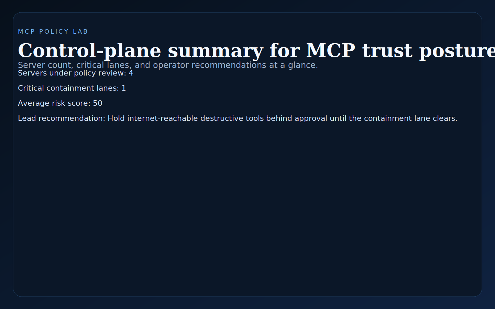
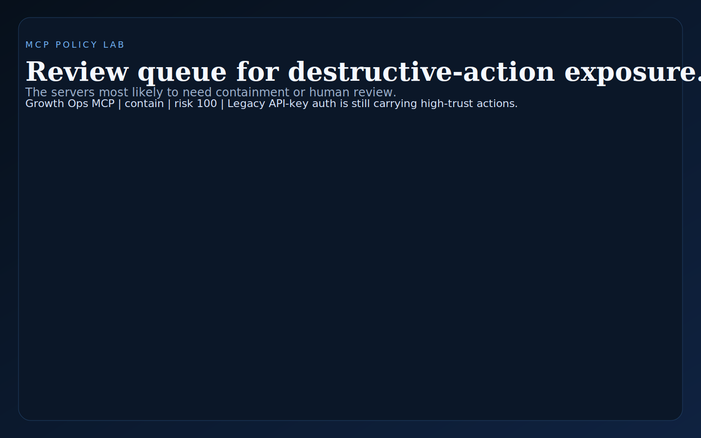
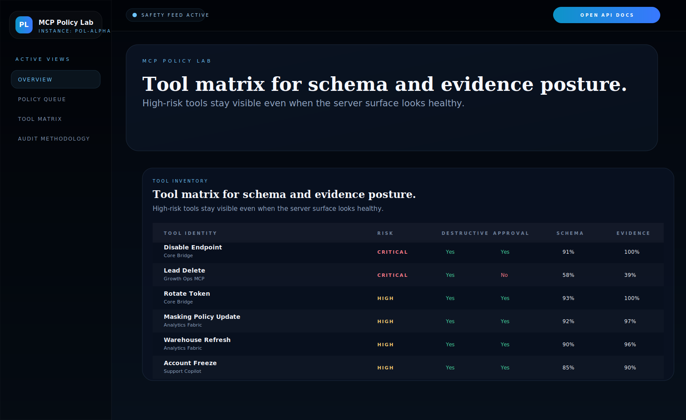
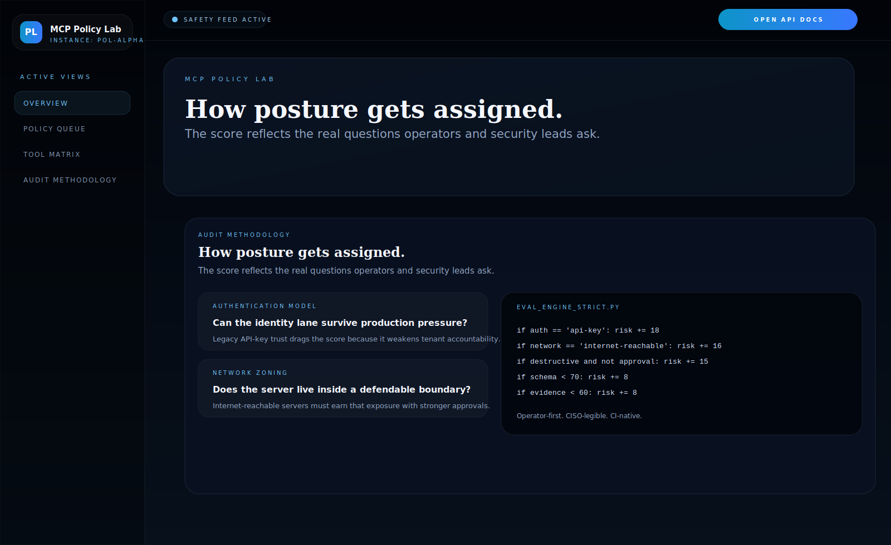

# MCP Policy Lab

Python and FastAPI control surface for **evaluating MCP server trust posture**, destructive-action controls, schema hygiene, and operator-facing review workflows.

> **What this repo proves**
>
> MCP governance is not just about what tools exist. It is about whether those tools are reviewable, approvable, and safe enough to expose in production operator workflows.

## Why this repo exists

Many MCP examples stop at connectivity. Real platform and security teams need a different answer:

- which servers deserve trust now
- which tools should be held behind human approval
- where schema coverage is too weak for safe review
- where evidence retention is too thin to survive an incident review

`mcp-policy-lab` models that policy layer directly. It evaluates MCP servers and tools, assigns `stable`, `review`, or `contain` posture, and gives operators a queue of what to inspect next.

## Screenshots






## What it includes

- FastAPI service with HTML proof surfaces and JSON APIs
- sample MCP server inventory with tool-level risk classes
- posture scoring for auth model, network zone, approval hygiene, schema coverage, and evidence retention
- operator queue for `review` and `contain` lanes
- SVG proof assets generated from the same service state
- unit tests, smoke checks, and GitHub Actions CI

## Local run

```powershell
Set-Location "C:\Users\chaus\dev\repos\mcp-policy-lab"
py -3.11 -m venv .venv
.\.venv\Scripts\pip.exe install -r requirements.txt
.\.venv\Scripts\python.exe -m app.main
```

Open:

- [http://127.0.0.1:4926/](http://127.0.0.1:4926/)
- [http://127.0.0.1:4926/policies](http://127.0.0.1:4926/policies)
- [http://127.0.0.1:4926/tool-matrix](http://127.0.0.1:4926/tool-matrix)
- [http://127.0.0.1:4926/audit](http://127.0.0.1:4926/audit)
- [http://127.0.0.1:4926/docs](http://127.0.0.1:4926/docs)

If the port is busy:

```powershell
$env:PORT = "4930"
.\.venv\Scripts\python.exe -m app.main
```

## Validation

```powershell
.\.venv\Scripts\python.exe -m unittest discover -s tests
.\.venv\Scripts\python.exe scripts\run_demo.py
.\.venv\Scripts\python.exe scripts\smoke_check.py
.\.venv\Scripts\python.exe scripts\render_readme_assets.py
```

## API routes

- `GET /api/dashboard/summary`
- `GET /api/servers`
- `GET /api/servers/{server_id}`
- `GET /api/tools`
- `GET /api/evaluations`
- `GET /api/sample`

## Repo layout

```text
app/
  data/
  services/
docs/
scripts/
screenshots/
tests/
```
