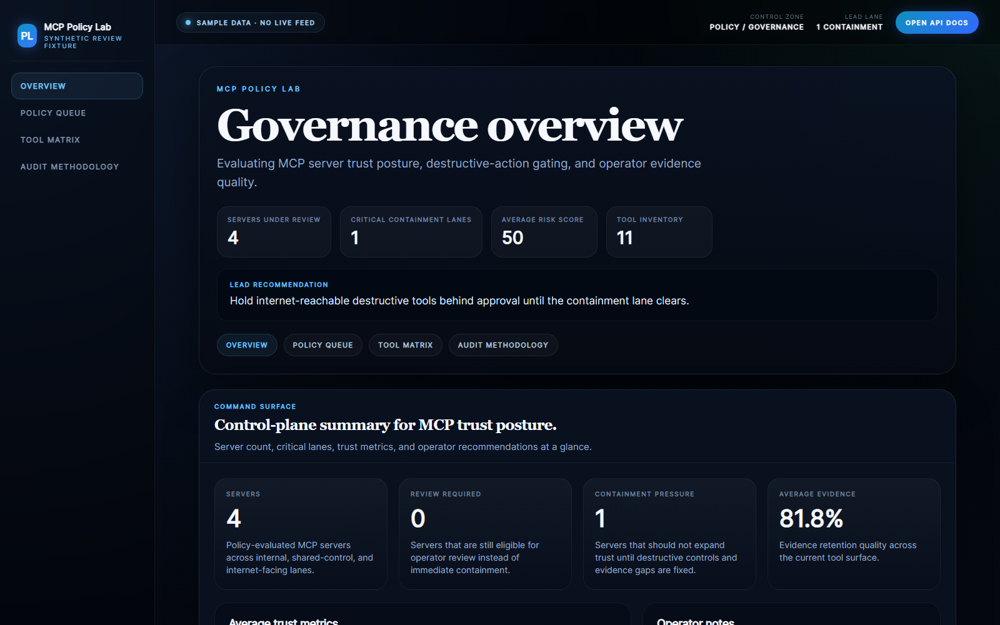
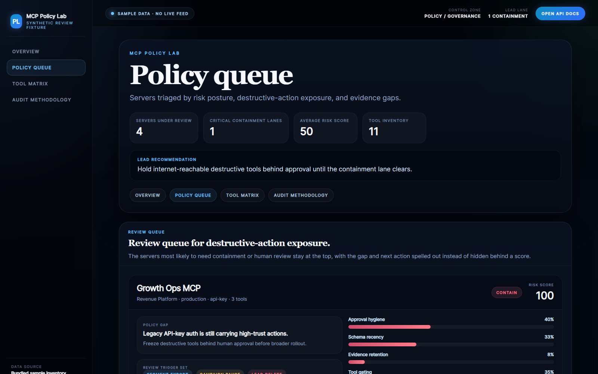
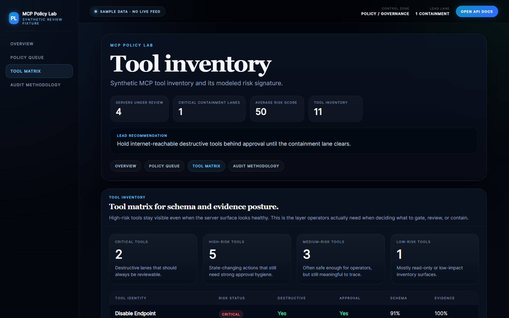
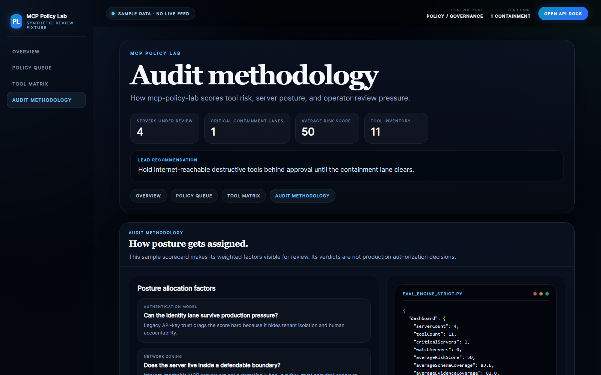
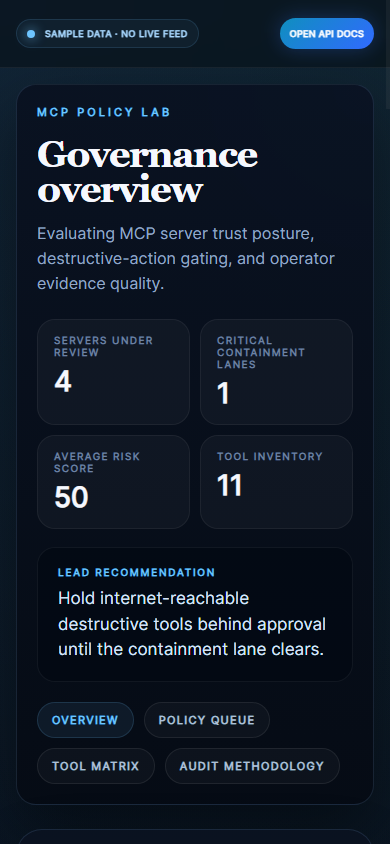

# MCP Policy Lab

Python and FastAPI **sample-data policy lab** for exploring MCP server trust posture, destructive-action controls, schema hygiene, and operator-facing review workflows. It does not connect to live MCP servers or enforce tool permissions.

> **What this repo proves**
>
> MCP governance is not just about what tools exist. It is about whether those tools are reviewable, approvable, and safe enough to expose in production operator workflows.

## Why this repo exists

Many MCP examples stop at connectivity. Real platform and security teams need a different answer:

- which servers deserve trust now
- which tools should be held behind human approval
- where schema coverage is too weak for safe review
- where evidence retention is too thin to survive an incident review

`mcp-policy-lab` models that policy layer directly. It evaluates MCP servers and tools, assigns `stable`, `review`, or `contain` posture, and gives operators a queue of what to inspect next.

## Screenshots

These are browser captures of the local service with its bundled synthetic inventory, taken at 1600 × 1000. They are not production monitoring evidence.







## What it includes

- FastAPI service with HTML proof surfaces and JSON APIs
- sample MCP server inventory with tool-level risk classes
- posture scoring for auth model, network zone, approval hygiene, schema coverage, and evidence retention
- operator queue for `review` and `contain` lanes
- browser screenshots of the bundled synthetic inventory
- unit tests, smoke checks, and GitHub Actions CI

## Read-only inventory review

`scripts/review_inventory.py` turns one **complete, locally captured** MCP `tools/list` JSON response into a review packet. It makes no network connection and calls no MCP tool. Pass the source label and full source commit you observed when capturing the file; these values are reported provenance, not cryptographic attestations:

```powershell
.\.venv\Scripts\python.exe scripts\review_inventory.py .\tools-list.json --source local-mcp-server --commit 0123456789abcdef0123456789abcdef01234567 > .\review-packet.json
```

The packet records import time and input SHA-256, counts schema fields, and lists self-declared `readOnlyHint`, `destructiveHint`, `idempotentHint`, and `openWorldHint` values. It separately lists names with missing read-only hints and names declaring non-read-only, destructive, or open-world behavior. It omits descriptions, schema contents, and defaults. It rejects a paginated or malformed inventory, duplicate tool names, and invalid hints. Tool names remain in the local packet; inspect it before sharing.

An analyst can optionally supply a local JSON map of tool names to `read-only`, `approval-required`, `block`, or `needs-evidence` using `--proposals .\proposed-dispositions.json`. The packet counts proposed dispositions and flags direct conflicts with declared hints. Every tool remains `unassessed`: a proposal is not an operator decision or permission grant, and neither it nor server annotations prove authentication, side effects, logging, approval enforcement, or retention. The web UI and APIs above still use only the bundled synthetic fixture.

A [source-bound Kinetic Gain review draft](docs/pilots/mcp-kinetic-gain-operator-review-2026-09-30.md) includes a 75-tool provisional disposition map. Its operation labels come from static handler review and require accountable operator confirmation against the deployed client, target, and permissions before use.

The [pilot permission gate](docs/pilots/mcp-kinetic-gain-permission-gate-2026-10-01.md) names the evidence required for any connected pilot. Do not connect a pilot client until its permissions are enforced and verified in the separate MCP server; this repository cannot grant those permissions or verify an operator's approval.

## Local run

```powershell
cd mcp-policy-lab
py -3.11 -m venv .venv
.\.venv\Scripts\pip.exe install -r requirements.txt
.\.venv\Scripts\python.exe -m app.main
```

Open:

- [http://127.0.0.1:4926/](http://127.0.0.1:4926/)
- [http://127.0.0.1:4926/policies](http://127.0.0.1:4926/policies)
- [http://127.0.0.1:4926/tool-matrix](http://127.0.0.1:4926/tool-matrix)
- [http://127.0.0.1:4926/audit](http://127.0.0.1:4926/audit)
- [http://127.0.0.1:4926/docs](http://127.0.0.1:4926/docs)

If the port is busy:

```powershell
$env:PORT = "4930"
.\.venv\Scripts\python.exe -m app.main
```

## Validation

```powershell
.\.venv\Scripts\python.exe -m unittest discover -s tests
.\.venv\Scripts\python.exe scripts\run_demo.py
.\.venv\Scripts\python.exe scripts\smoke_check.py
```

## API routes

- `GET /api/dashboard/summary`
- `GET /api/servers`
- `GET /api/servers/{server_id}`
- `GET /api/tools`
- `GET /api/evaluations`
- `GET /api/sample`

## Repo layout

```text
app/
  data/
  services/
docs/
scripts/
screenshots/
tests/
```
